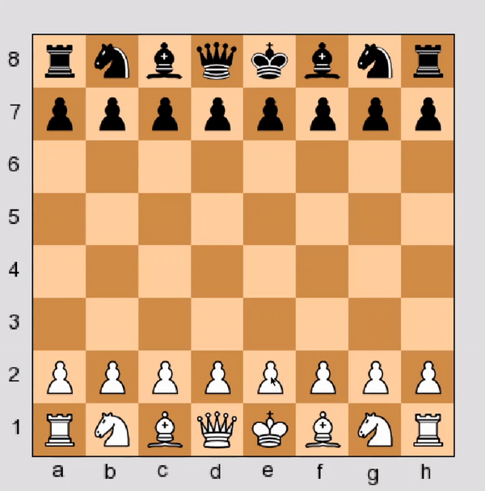

# Chess

A simple Chess program built with Pygame. 

## Setup
The following tools/dependencies were used in the project:
* [Python](https://www.python.org/) - version 3.7.3
* [Pygame](https://www.pygame.org/docs/) - version 1.9.6

`Chess.py` contains the main game. To run this on terminal, simply type `python Chess.py`

The game in action:

**Note: Development is still in progress, however most of the game is built and functional.** 

